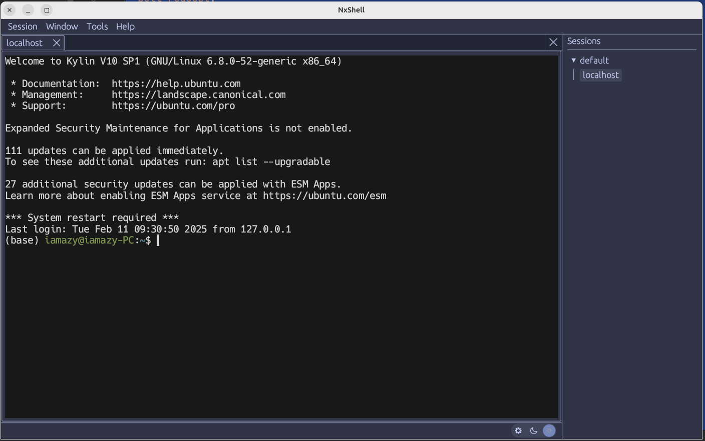

  

	<h1 align="center">NxShell</h1>
	

An open-source, cross-platform SSH session manager powered by <a href="https://github.com/emilk/egui">egui</a> and <a href="https://github.com/alacritty/alacritty">Alacritty</a>   Aiming to become the next-generation Xshell.    

     
    

      
      
      
      
     
     
    

     

    

### Features ❇️

- [x] Cross-platforms
- [x] Multi Execute
- [x] Multi Instance
- [x] Key features of **Alacritty**
- [x] Ssh session manager

### Roadmap 🏁

- [ ] Scrollbar
- [ ] Minimap
- [ ] Colorful terminal
- [ ] Sftp
- [ ] Terminal operation recorder
- [ ] Autocompletion powered by AI
- [ ] GPU accelerated

### Acknowledgments ❤️

- [egui_term](https://github.com/Harzu/egui_term): Terminal emulator widget powered by EGUI framework and alacritty
  terminal backend.
- [alacritty](https://github.com/alacritty/alacritty): A cross-platform, OpenGL terminal emulator.
- [wezterm (ssh)](https://github.com/wezterm/wezterm): A GPU-accelerated cross-platform terminal emulator and
  multiplexer and implemented in Rust

### License 🚨

<a href="./LICENSE">AGPL 3.0 License</a>